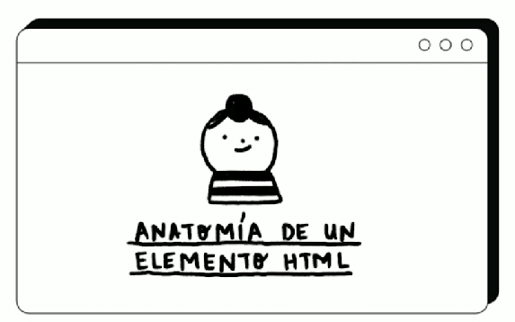
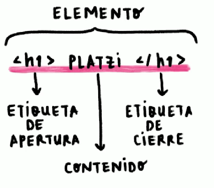
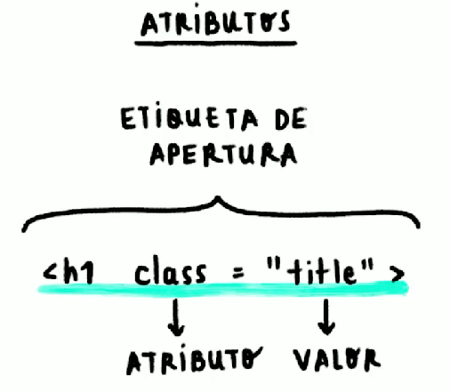
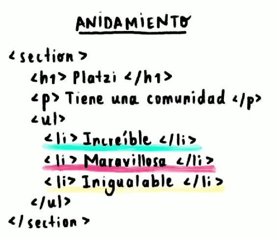
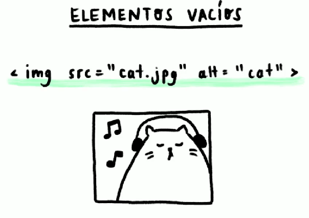
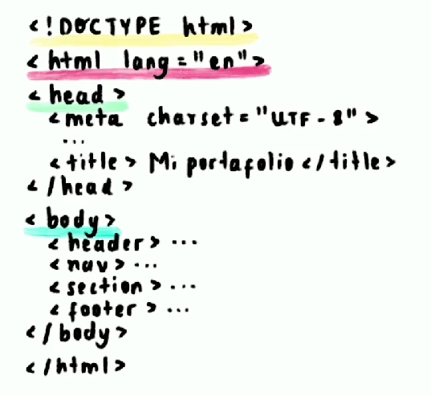
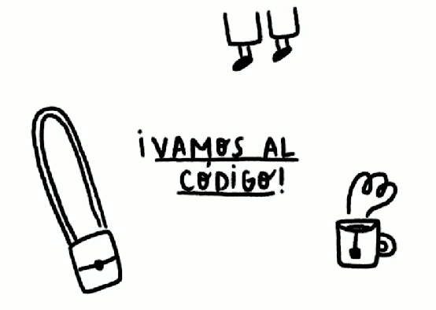
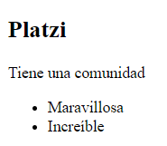

# ANATOMÍA DE UN DOCUMENTO HTML Y SUS ELEMENTOS

Anidamiento se refiere a que una etiqueta permite tener mas etiquetas adentro

La estructura de HTML esta dada como:

El Doctype es para indicarle que se va a trabajar con un elemento HTML, después sigue la etiqueta mas importante que es html el cual recibe como atributo lang, que es el lenguaje en el cuál esta el html, después la estructura se divide en dos, la etiqueta head en donde se puede colocar el simbolo y nombre de la pestaña en el navegador y los enlaces a archivos externos, y la segunda etiqueta es el body en el cuál se diseña toda la estructura  HTML de la página web.

En Visual Studio Code, escribiendo html:5 se genera la estructura base de HTML

~~~HTML
<!DOCTYPE html>
<html lang="en">
<head>
    <meta charset="UTF-8">
    <meta http-equiv="X-UA-Compatible" content="IE=edge">
    <meta name="viewport" content="width=device-width, initial-scale=1.0">
    <title>Document</title>
</head>
<body>
    <section>
        <h1>Platzi</h1>
        
Tiene una comunidad

        <ul>
            <li>Maravillosa</li>
            <li>Increíble</li>
        </ul>
    </section>
</body>
</html>
~~~

