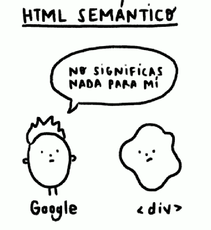

# ¿QUÉ ES HTML SEMÁNTICO?

La idea es evitar usar en exceso la etiqueta div, ya que se busca es que se utilice las etiquetas adecuadas según lo que se realice. Esto ayuda para tener un código mas legible ademas de ayudar en el posicionamiento CEO de Google.

~~~HTML
<!DOCTYPE html>
<html lang="en">
<head>
    <meta charset="UTF-8">
    <meta http-equiv="X-UA-Compatible" content="IE=edge">
    <meta name="viewport" content="width=device-width, initial-scale=1.0">
    <title>Document</title>
</head>
<body>
    <!-- La estructura de un HTML debe estar dado por 
    etiquetas que corresponda a los que se quiera
    hacer y evitar al máximo el uso de div -->
    <header>
    </header>
    <nav>
        <ul></ul>
    </nav>
    <footer></footer>
</body>
</html>
~~~

Enlaces Externos

[Html Semántico](https://www.espai.es/blog/2018/01/que-es-el-html-semantico/)