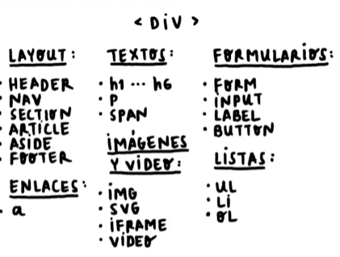

# ETIQUETAS DE HTML MÁS USADAS

**LAYOUT:** El diseño de toda la pagina, entre ellas se encuentra las etiquetas que dan la estructura base

**ENLACE:** Es la etiqueta que permite direccionar al usuario cuando se la clik en el pc o tab en el celular.

**TEXTOS:** En estas se encuentra las etiquetas para títulos (h1-h6), párrafos (p) y dividir los párrafos en diferentes secciones (span).

**IMÁGENES Y VIDEOS:** Etiquetas para colocar imágenes y videos dentro de la página.

**FORMULARIO:** En estos se encuentra las etiquetas form que es la caja de los formularios, input en donde se puede utilizar de muchas formas como por ejemplo, para ingresar un texto, un número o un checklist, tambien están los labels que son como el texto de lo que se pide en el input y esta el button que un botón que realiza una opción cuando se presiona.

**LISTAS:** En estas se encuentran las etiquetas necesarias para realizar listas.

[htmlreference](https://htmlreference.io/)

En este link se encuentra una guía de tos las etiquetas que se utilizan en HTML

La parte del body con varias etiquetas queda como:

~~~html
<body>
    <!-- Etiqueta para crear la barra superior dde 
    navegación -->
    <nav>
        <!-- Etiqueta para crear la lista de opciones de la 
        barra de navegación -->
        <ul>
            <li>about as</li>
            <li>contact us</li>
        </ul>
    </nav>
    <!-- Etiqueta para una nueva sección -->
    <section>
        <!-- Los div se pueden utilizar pero la idea es 
            reducirlos al máximo -->
        

            <!-- Se ingresa una imagen -->
            
        

        

            <!-- Título -->
            <h1>Cats</h1>
            <!-- Párrafo -->
            
Cats are awesome

        

    </section>
    <!-- Formularios -->
    <form action="">
        <label for="name">Name</label>
        <input type="text" id="name">
    </form>
    <!-- etiqueta ancla -->
    <a href="https://platzi.com/home">Go to Platzi</a>
</body>
</html>
~~~