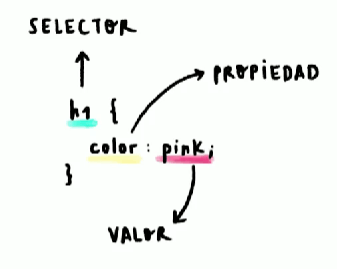

# ANATOMÍA DE UNA DECLARACIÓN CSS: SELECTORES, PROPIEDADES Y VALORES

El componente mas importante es el selector, que es el puente entre el CSS y el HTML, despues se encierra entre llaves todo el código CSS, dentro de estas se colocan las propiedades, que pueden existir muchos tipos de propiedades y el resultado que se desea se conoce como valor.
