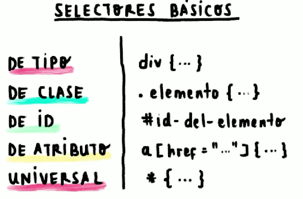
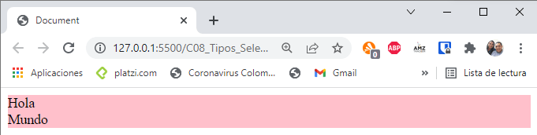
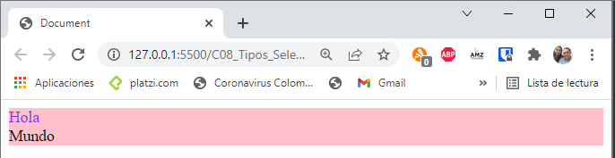
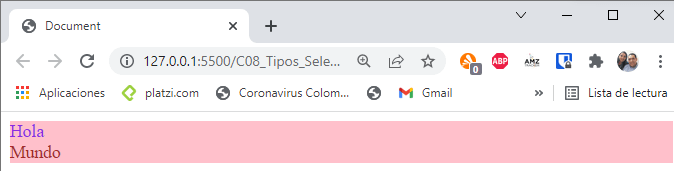
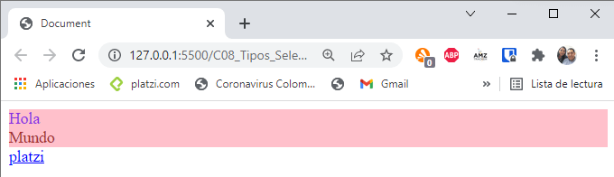
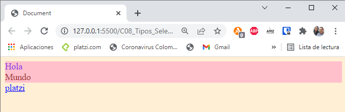
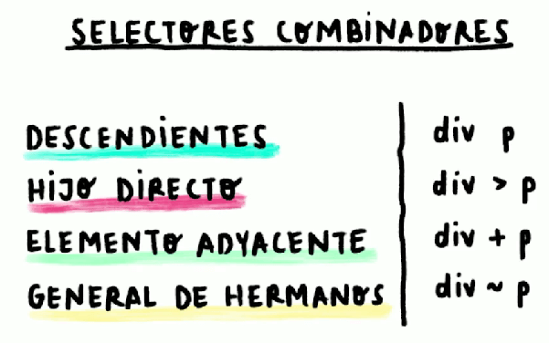
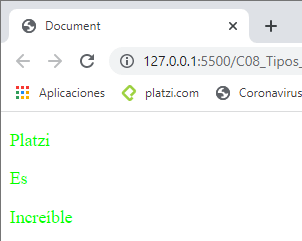
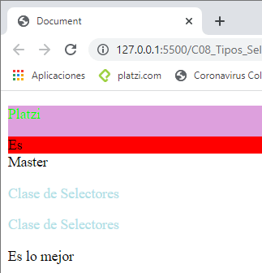

# TIPOS DE SELECTORES: BÁSICOS Y COMBINADORES

Los selectores de Tipo solamente se coloca el nombre de la etiqueta, es de tener cuidado porque el estilo se va  aplicar a todos los div que esten en el HTML. De clase son selectores que crea la unión con el HTML por el nombre que se le haya dado. El selector ID funciona de la misma forma que el de clase pero lo prioriza mas. De atributo se une por medio de un href y por último el universal, que es el selector que aplica el estilo CSS a todo el HTML.

~~~HTML
<!DOCTYPE html>
<html lang="en">
<head>
    <meta charset="UTF-8">
    <meta http-equiv="X-UA-Compatible" content="IE=edge">
    <meta name="viewport" content="width=device-width, initial-scale=1.0">
    <title>Document</title>
    <!-- La etiqueta style permite escribir en CSS dentro de un 
    archivo HTML -->
    
</head>
<body>
    
Hola

    
Mundo

</body>
</html>
~~~

Para el código se agrega solamente un selector de tipo dentro de la etiqueta style que va a aplicar a todas las etiquetas div, mostrando como resultado:

Con selectores de clase primero se crea el nombre de la clase para despues copiarlo dentro de la etiqueta style

~~~html
<head>
    
</head>
<body>
    
Hola

    
Mundo

</body>
</html>
~~~

En selectores de id se referencia por medio de un hashtag

~~~html
<head>
    
</head>
<body>
    
Hola

    
Mundo

</body>
~~~

El selector de atributos toma en cuenta el href que se le coloca a la etiqueta ancla

~~~html
<head>
    
</head>
<body>
    
Hola

    
Mundo

    <a href="https://platzi.com/home">platzi</a>
</body>
~~~

El selector universal aplica los estilos a todo el HTML

~~~html
<head>
    
</head>
<body>
    
Hola

    
Mundo

    <a href="https://platzi.com/home">platzi</a>
</body>
~~~

~~~html
<!DOCTYPE html>
<html lang="en">
<head>
    <meta charset="UTF-8">
    <meta http-equiv="X-UA-Compatible" content="IE=edge">
    <meta name="viewport" content="width=device-width, initial-scale=1.0">
    <title>Document</title>
    
</head>
<body>
    

        
Platzi

        
Es

        
Increíble

    

</body>
</html>
~~~

~~~html
<!DOCTYPE html>
<html lang="en">
<head>
    <meta charset="UTF-8">
    <meta http-equiv="X-UA-Compatible" content="IE=edge">
    <meta name="viewport" content="width=device-width, initial-scale=1.0">
    <title>Document</title>
    
</head>
<body>
    

        

            
Platzi

            
Es

        

    

    

        Master
    

    
Clase de Selectores

    
Clase de Selectores

    <section>
        Es lo mejor
    </section>
</body>
</html>
~~~

