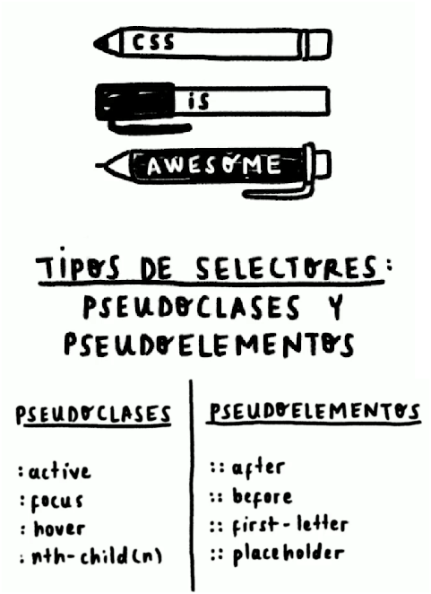
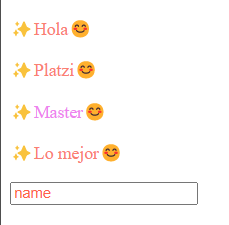

# TIPOS DE SELECTORES: PSEUDOCLASES Y PSEUDOELEMENTOS

Las Pseudoclases permite llegar a las acciones que realiza el usuario, por ejemplo al hacer clic sobre un botón, este puede cambiar de color, de estilo con :active. Otro ejemplo es el cambio de estilos al pasar el puntero por encima de un sector por medio de :hover.

Los pseudoelementos, son los que permiten acceder a elementos que con clases y pseudoclases no se puede acceder, como por ejemplo la primera letra de un texto, agregar texto al inicio o texto al final de este.

Los pseudoclases se escriben con : mientras los pseudoelementos se escribe con ::

~~~html
<!DOCTYPE html>
<html lang="en">
<head>
    <meta charset="UTF-8">
    <meta http-equiv="X-UA-Compatible" content="IE=edge">
    <meta name="viewport" content="width=device-width, initial-scale=1.0">
    <title>Document</title>
    <!-- Se agregan los estilos en CSS -->
    
</head>
<body>
    
Hola

    

        
Platzi

        
Master

        
Lo mejor

    

    <input type="text" placeholder="name">
</body>
</html>
~~~

Enlaces Externos

[PseudoElements](https://developer.mozilla.org/en-US/docs/Web/CSS/Pseudo-elements)

[PseudoClass](https://css-tricks.com/pseudo-class-selectors/)