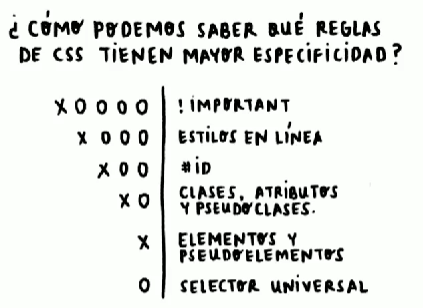

# CASCADA Y ESPECIFICIDAD EN CSS

~~~html
<!DOCTYPE html>
<html lang="en">
<head>
    <meta charset="UTF-8">
    <meta http-equiv="X-UA-Compatible" content="IE=edge">
    <meta name="viewport" content="width=s, initial-scale=1.0">
    <title>Document</title>
    <!-- Estilos en CSS -->
    
</head>
<body>
    <h1>Platzi</h1>
</body>
</html>
~~~

Se escribe el siguiente código

~~~html
<!DOCTYPE html>
<html lang="en">
<head>
    <meta charset="UTF-8">
    <meta http-equiv="X-UA-Compatible" content="IE=edge">
    <meta name="viewport" content="width=device-width, initial-scale=1.0">
    <title>Document</title>
    
</head>
<body>
    <!-- Etiqueta que contiene tanto id como clase -->
    
Platzi

</body>
</html>
~~~

Por especificidad un id va a ser mas importante que una clase, por tanto aparece la letra en color rojo

## Enlaces Externos

[Calculadora de Especificidad](https://specificity.keegan.st/)

[Colores en Html](https://htmlcolorcodes.com/)