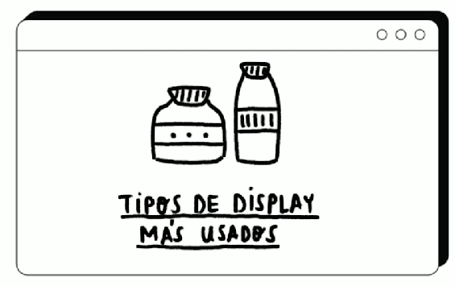
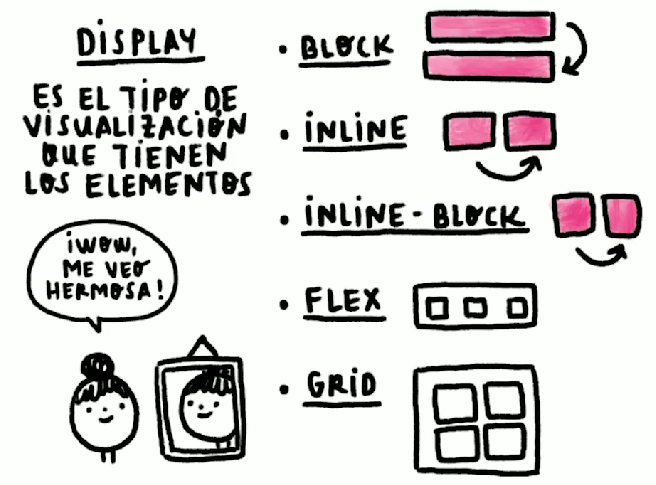
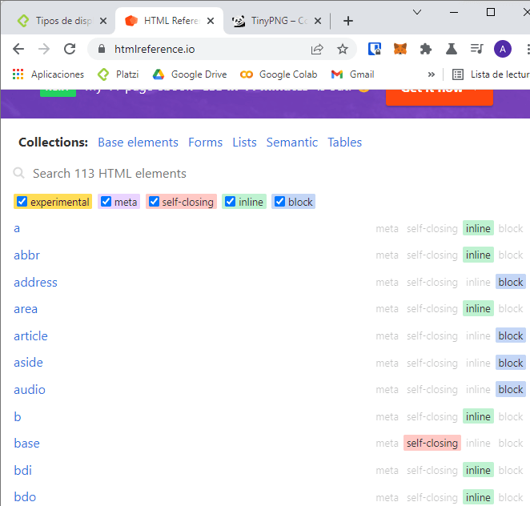

# TIPOS DE DISPLAY MÁS USADOS: BLOCK, INLINE E INLINE-BLOCK

En htmlreference.io muestra las etiquetas que se utilizan en HTML y el tipo de display en el cual funciona, por ejemplo la etiqueta article funciona en display de bloques.

~~~html
<!DOCTYPE html>
<html lang="en">
<head>
    <meta charset="UTF-8">
    <meta http-equiv="X-UA-Compatible" content="IE=edge">
    <meta name="viewport" content="width=device-width, initial-scale=1.0">
    <title>Document</title>
    
</head>
<body>
    <!-- div es un elemento de bloque -->
    
bloque

    <!-- a es un elemento inline -->
    <a href="/">inline</a>
    <!-- Button es un elemento inline-block -->
    <button>inline block</button>
</body>
</html>
~~~

