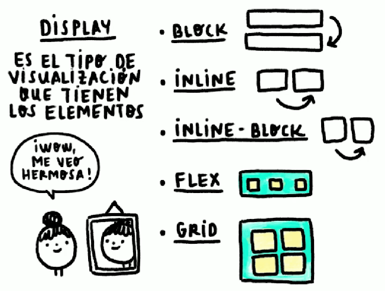
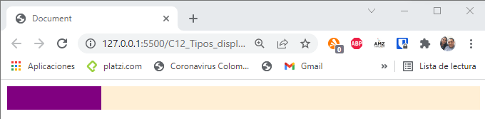
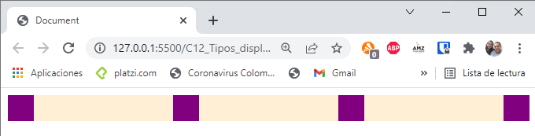
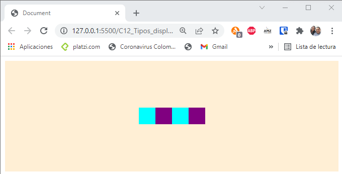
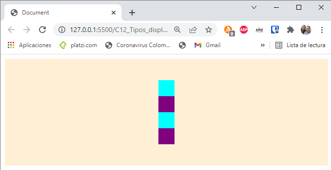
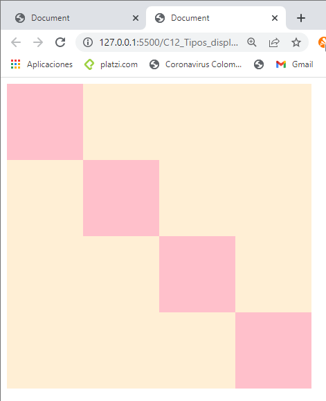

# TIPOS DE DISPLAY MÁS USADOS: FLEXBOX Y CSS GRID

La ventaja del flexbox es que se tiene un contenedor, dentro del cuales se tienen los items que son los contenedores hijos, lo que permite que los items se puedan mostrar como filas o como columnas, alinearlos a las izquierda, a la derecha o centrado.

~~~html
<!DOCTYPE html>
<html lang="en">
<head>
    <meta charset="UTF-8">
    <meta http-equiv="X-UA-Compatible" content="IE=edge">
    <meta name="viewport" content="width=device-width, initial-scale=1.0">
    <title>Document</title>
    
</head>
<body>
    <!-- Se crea el contenedor para el flexbox -->
    

        <!-- Se crea los items para el flexbox -->
        

        

        

        

    

</body>
</html>
~~~

Se le agrega el justificado del contenido al container del flexbox

~~~html
.container {
    display: flex;
    background: papayawhip;
    justify-content: space-between;
}
~~~

 
Para centrar los elementos dentro del container, se agrega align-items 

~~~html

~~~

Para convertir los items de filas a columnas, se agrega la linea de flex-direction: column
~~~html

~~~

~~~html
<!DOCTYPE html>
<html lang="en">
<head>
    <meta charset="UTF-8">
    <meta http-equiv="X-UA-Compatible" content="IE=edge">
    <meta name="viewport" content="width=device-width, initial-scale=1.0">
    <title>Document</title>
    
</head>
<body>
    

        

        

        

        

    

</body>
</html>
~~~

